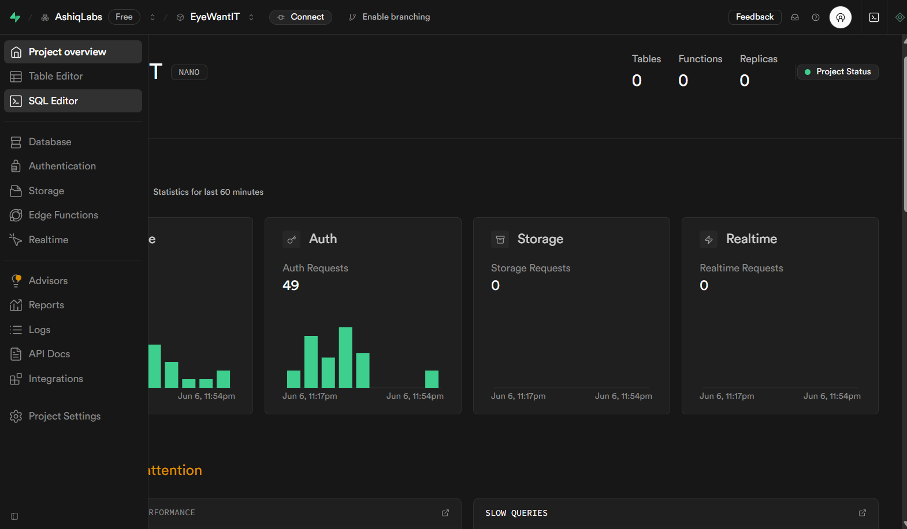

# Complete Guide to Creating Tables in Supabase

*A comprehensive manual for setting up database tables with proper security, performance, and functionality*

---

## Table of Contents

1. [Overview](#overview)
2. [Pre-Planning Phase](#pre-planning-phase)
3. [Database Design](#database-design)
4. [Creating the Table](#creating-the-table)
5. [Security Setup](#security-setup)
6. [Performance Optimization](#performance-optimization)
7. [Frontend Functions](#frontend-functions)
8. [Testing and Validation](#testing-and-validation)
9. [Maintenance and Updates](#maintenance-and-updates)
10. [Common Patterns](#common-patterns)

---

## Overview

Every table you create in Supabase requires several components to work properly:

- **Table Schema** - The structure and fields
- **Security Policies** - Who can access what data
- **Indexes** - For fast queries
- **Frontend Functions** - CRUD operations
- **Error Handling** - Graceful failure management

**Time Investment:** Plan for 2-4 hours per table (including testing)

---

## Pre-Planning Phase

### 1. Define Your Data Requirements

Before writing any code, answer these questions:

**Data Questions:**

- What information do you need to store?
- Which fields are required vs optional?
- What are the data types for each field?
- Are there any validation rules (e.g., score between 1-10)?
- How will this table relate to other tables?

**User Questions:**

- Who should be able to see this data?
- Who should be able to modify this data?
- Should users only see their own data?
- Do you need admin-level access?
- Will there be sharing/collaboration features?

**Performance Questions:**

- How much data will this table hold?
- What queries will be run most often?
- Which fields will be used for filtering/searching?

### 2. Create a Data Schema Diagram

Draw out your table structure:

```
Table: wishlist_items
┌─────────────────┬──────────────┬──────────────┬─────────────┐
│ Field Name      │ Data Type    │ Required     │ Notes       │
├─────────────────┼──────────────┼──────────────┼─────────────┤
│ id              │ UUID         │ Yes (PK)     │ Auto-gen    │
│ user_id         │ UUID         │ Yes (FK)     │ -> users    │
│ name            │ TEXT         │ Yes          │ Item name   │
│ description     │ TEXT         │ No           │ Optional    │
│ score           │ INTEGER      │ No           │ 1-10 range  │
│ is_private      │ BOOLEAN      │ No           │ Default F   │
│ created_at      │ TIMESTAMP    │ Yes          │ Auto-gen    │
└─────────────────┴──────────────┴──────────────┴─────────────┘
```

---

## Database Design

### 1. Choose Your Column Types

**Common Supabase Data Types:**

| Use Case | Data Type | Example | Notes |
|----------|-----------|---------|-------|
| Unique ID | `UUID` | `123e4567-e89b...` | Always use for primary keys |
| User Reference | `UUID` | Links to auth.users | Foreign key to users |
| Short Text | `TEXT` | "Product Name" | No length limit needed |
| Long Text | `TEXT` | Descriptions, notes | Same as short text |
| Numbers | `INTEGER` | 42, -10, 0 | Whole numbers only |
| Decimals | `NUMERIC` | 19.99, 3.14159 | Precise decimal numbers |
| Yes/No | `BOOLEAN` | true, false | Two-state values |
| Timestamps | `TIMESTAMP WITH TIME ZONE` | 2025-01-15 14:30:00+00 | Always include timezone |
| JSON Data | `JSONB` | {"key": "value"} | Structured data |

### 2. Set Up Relationships

**Foreign Key Patterns:**

```sql
-- Link to users table
user_id UUID REFERENCES auth.users(id) ON DELETE CASCADE

-- Link to another custom table
category_id UUID REFERENCES categories(id) ON DELETE SET NULL

-- Self-referencing (like replies to comments)
parent_id UUID REFERENCES comments(id) ON DELETE CASCADE
```

**Relationship Types:**

- `ON DELETE CASCADE` - Delete child when parent is deleted
- `ON DELETE SET NULL` - Clear reference when parent is deleted
- `ON DELETE RESTRICT` - Prevent parent deletion if children exist

### 3. Add Constraints and Defaults

**Common Constraints:**

```sql
-- Ensure values are in a specific range
score INTEGER CHECK (score >= 1 AND score <= 10)

-- Ensure email format (basic)
email TEXT CHECK (email LIKE '%@%')

-- Ensure non-empty strings
name TEXT NOT NULL CHECK (length(trim(name)) > 0)

-- Ensure positive numbers
price NUMERIC CHECK (price > 0)
```

**Useful Defaults:**

```sql
-- Auto-generate IDs
id UUID DEFAULT gen_random_uuid() PRIMARY KEY

-- Auto-set timestamps
created_at TIMESTAMP WITH TIME ZONE DEFAULT NOW()
updated_at TIMESTAMP WITH TIME ZONE DEFAULT NOW()

-- Default boolean values
is_active BOOLEAN DEFAULT true
is_private BOOLEAN DEFAULT false

-- Default numbers
score INTEGER DEFAULT 5
priority INTEGER DEFAULT 1
```

---

## Creating the Table

### 1. Navigate to Supabase SQL Editor





1. Open your Supabase project dashboard
2. Click on "SQL Editor" in the left sidebar
3. Click "New Query" to create a new SQL script

### 2. Write Your CREATE TABLE Statement

**Template:**

```sql
-- ================================================================
-- [TABLE_NAME] TABLE SETUP
-- ================================================================
-- Description: What this table stores and why

CREATE TABLE [table_name] (
  -- Primary key (always include this)
  id UUID DEFAULT gen_random_uuid() PRIMARY KEY,

  -- User reference (if data belongs to users)
  user_id UUID REFERENCES auth.users(id) ON DELETE CASCADE,

  -- Your custom fields here
  name TEXT NOT NULL,
  description TEXT,

  -- Timestamps (recommended for all tables)
  created_at TIMESTAMP WITH TIME ZONE DEFAULT NOW(),
  updated_at TIMESTAMP WITH TIME ZONE DEFAULT NOW()
);
```

**Real Example:**

```sql
CREATE TABLE wishlist_items (
  id UUID DEFAULT gen_random_uuid() PRIMARY KEY,
  user_id UUID REFERENCES auth.users(id) ON DELETE CASCADE,
  name TEXT NOT NULL,
  description TEXT,
  link TEXT,
  score INTEGER CHECK (score >= 1 AND score <= 10) DEFAULT 5,
  is_private BOOLEAN DEFAULT false,
  dibbed_by UUID REFERENCES auth.users(id) ON DELETE SET NULL,
  dibbed_at TIMESTAMP WITH TIME ZONE,
  created_at TIMESTAMP WITH TIME ZONE DEFAULT NOW(),
  updated_at TIMESTAMP WITH TIME ZONE DEFAULT NOW()
);
```

### 3. Execute the Query


1. Paste your CREATE TABLE statement
2. Click "Run" or press Ctrl+Enter
3. Check for success message or error details


---

## Security Setup

### 1. Enable Row Level Security (RLS)

**Always do this first:**

```sql
ALTER TABLE [table_name] ENABLE ROW LEVEL SECURITY;
```

**Why:** Without RLS, any authenticated user can access all data in your table.

### 2. Create Security Policies

**Basic User-Only Access Pattern:**

```sql
-- Users can only access their own data
CREATE POLICY "Users can manage their own items" ON [table_name]
  FOR ALL USING (auth.uid() = user_id);
```

**Advanced Patterns:**

**Read-Only Public Data:**

```sql
-- Everyone can read, only owners can modify
CREATE POLICY "Public read access" ON [table_name]
  FOR SELECT USING (true);

CREATE POLICY "Owner write access" ON [table_name]
  FOR INSERT WITH CHECK (auth.uid() = user_id);

CREATE POLICY "Owner update access" ON [table_name]
  FOR UPDATE USING (auth.uid() = user_id);

CREATE POLICY "Owner delete access" ON [table_name]
  FOR DELETE USING (auth.uid() = user_id);
```

**Conditional Access:**

```sql
-- Users can see public items from others, all their own items
CREATE POLICY "Conditional access" ON [table_name]
  FOR SELECT USING (
    auth.uid() = user_id OR
    (is_public = true AND user_id != auth.uid())
  );
```

**Admin Access:**

```sql
-- Check if user has admin role
CREATE POLICY "Admin access" ON [table_name]
  FOR ALL USING (
    EXISTS (
      SELECT 1 FROM user_roles
      WHERE user_id = auth.uid() AND role = 'admin'
    )
  );
```

### 3. Test Your Security

**Screenshot Space:** *Insert screenshot of policy testing*

1. Create test data with different users
2. Try accessing data you shouldn't be able to see
3. Verify policies work as expected

---

## Performance Optimization

### 1. Create Essential Indexes

**Always create these indexes:**

```sql
-- Index on user_id (for user-specific queries)
CREATE INDEX idx_[table_name]_user_id ON [table_name](user_id);

-- Index on created_at (for chronological queries)
CREATE INDEX idx_[table_name]_created_at ON [table_name](created_at);
```

**Additional indexes based on usage:**

```sql
-- For searching by status
CREATE INDEX idx_[table_name]_status ON [table_name](status);

-- For filtering by boolean flags
CREATE INDEX idx_[table_name]_is_active ON [table_name](is_active);

-- For complex queries (composite index)
CREATE INDEX idx_[table_name]_user_status ON [table_name](user_id, status);

-- For text search (if needed)
CREATE INDEX idx_[table_name]_name_search ON [table_name]
  USING gin(to_tsvector('english', name));
```

### 2. Consider Query Patterns

**Think about your most common queries:**

- "Show me all items for user X" → Index on user_id
- "Show me recent items" → Index on created_at
- "Show me active items" → Index on is_active
- "Search by name" → Text search index

---

## Frontend Functions

### 1. Set Up Your Supabase Client

**File: `lib/supabase.js`**

```javascript
import { createClient } from '@supabase/supabase-js'

const supabaseUrl = 'your-project-url'
const supabaseKey = 'your-anon-key'

export const supabase = createClient(supabaseUrl, supabaseKey)
```

### 2. Create CRUD Functions

**File: `lib/[table_name].js`**

**Required Functions for Every Table:**

```javascript
import { supabase } from './supabase'

// CREATE - Add new record
export const create[TableName] = async (data) => {
  const { data: result, error } = await supabase
    .from('[table_name]')
    .insert([data])
    .select()

  if (error) {
    console.error('Error creating [table_name]:', error)
    throw error
  }
  return result[0]
}

// READ - Get single record
export const get[TableName] = async (id) => {
  const { data, error } = await supabase
    .from('[table_name]')
    .select('*')
    .eq('id', id)
    .single()

  if (error) {
    console.error('Error fetching [table_name]:', error)
    throw error
  }
  return data
}

// READ - Get user's records
export const getUser[TableName]s = async () => {
  const { data, error } = await supabase
    .from('[table_name]')
    .select('*')
    .order('created_at', { ascending: false })

  if (error) {
    console.error('Error fetching user [table_name]s:', error)
    throw error
  }
  return data
}

// UPDATE - Modify existing record
export const update[TableName] = async (id, updates) => {
  const { data, error } = await supabase
    .from('[table_name]')
    .update({
      ...updates,
      updated_at: new Date().toISOString()
    })
    .eq('id', id)
    .select()

  if (error) {
    console.error('Error updating [table_name]:', error)
    throw error
  }
  return data[0]
}

// DELETE - Remove record
export const delete[TableName] = async (id) => {
  const { error } = await supabase
    .from('[table_name]')
    .delete()
    .eq('id', id)

  if (error) {
    console.error('Error deleting [table_name]:', error)
    throw error
  }
}
```

### 3. Add Custom Functions

**Based on your table's specific features:**

```javascript
// Example: Dibs functionality for wishlist
export const dibsItem = async (itemId) => {
  const { data: user } = await supabase.auth.getUser()

  if (!user.user) {
    throw new Error('Must be logged in to dibs an item')
  }

  const { data, error } = await supabase
    .from('wishlist_items')
    .update({
      dibbed_by: user.user.id,
      dibbed_at: new Date().toISOString()
    })
    .eq('id', itemId)
    .select()

  if (error) throw error
  return data[0]
}

// Example: Search functionality
export const searchItems = async (query) => {
  const { data, error } = await supabase
    .from('[table_name]')
    .select('*')
    .textSearch('name', query)
    .order('created_at', { ascending: false })

  if (error) throw error
  return data
}

// Example: Get public items from other users
export const getPublicItems = async () => {
  const { data, error } = await supabase
    .from('[table_name]')
    .select('*')
    .eq('is_private', false)
    .neq('user_id', (await supabase.auth.getUser()).data.user?.id)
    .order('created_at', { ascending: false })

  if (error) throw error
  return data
}
```

### 4. Error Handling Pattern

**Always include proper error handling:**

```javascript
export const [functionName] = async (params) => {
  try {
    const { data, error } = await supabase
      .from('[table_name]')
      // ... your query

    if (error) {
      // Log the full error for debugging
      console.error('Supabase error:', error)

      // Throw a user-friendly error
      throw new Error(`Failed to [action]: ${error.message}`)
    }

    return data
  } catch (error) {
    // Re-throw to let the UI handle it
    throw error
  }
}
```

---

## Testing and Validation

### 1. Test Data Creation

**Create test data for each scenario:**

```sql
-- Insert test data
INSERT INTO [table_name] (user_id, name, description) VALUES
  ((SELECT id FROM auth.users LIMIT 1), 'Test Item 1', 'Test description'),
  ((SELECT id FROM auth.users LIMIT 1), 'Test Item 2', 'Another test');
```

### 2. Test Security Policies

**Screenshot Space:** *Insert screenshot of testing different user scenarios*

1. Create multiple test users
2. Try to access other users' data
3. Verify policies block unauthorized access
4. Test edge cases (deleted users, etc.)

### 3. Test Frontend Functions

```javascript
// Test script you can run in browser console
const testCRUD = async () => {
  try {
    // Test CREATE
    const newItem = await create[TableName]({
      name: 'Test Item',
      description: 'Test Description'
    })
    console.log('Created:', newItem)

    // Test READ
    const items = await getUser[TableName]s()
    console.log('Fetched:', items)

    // Test UPDATE
    const updated = await update[TableName](newItem.id, {
      name: 'Updated Test Item'
    })
    console.log('Updated:', updated)

    // Test DELETE
    await delete[TableName](newItem.id)
    console.log('Deleted successfully')

  } catch (error) {
    console.error('Test failed:', error)
  }
}

// Run the test
testCRUD()
```

---

## Maintenance and Updates

### 1. Adding New Columns

```sql
-- Add a new column
ALTER TABLE [table_name]
ADD COLUMN new_field TEXT DEFAULT 'default_value';

-- Add with constraints
ALTER TABLE [table_name]
ADD COLUMN priority INTEGER CHECK (priority >= 1 AND priority <= 5) DEFAULT 1;
```

### 2. Updating Policies

```sql
-- Drop old policy
DROP POLICY "old_policy_name" ON [table_name];

-- Create new policy
CREATE POLICY "new_policy_name" ON [table_name]
  FOR ALL USING (new_condition);
```

### 3. Adding Indexes

```sql
-- Add new index for performance
CREATE INDEX idx_[table_name]_new_field ON [table_name](new_field);
```

### 4. Data Migration

```sql
-- Update existing data when adding new features
UPDATE [table_name]
SET new_field = 'calculated_value'
WHERE condition;
```

---

## Common Patterns

### 1. User-Owned Data Pattern

**Use when:** Each record belongs to a specific user

```sql
CREATE TABLE user_items (
  id UUID DEFAULT gen_random_uuid() PRIMARY KEY,
  user_id UUID REFERENCES auth.users(id) ON DELETE CASCADE,
  -- other fields
  created_at TIMESTAMP WITH TIME ZONE DEFAULT NOW()
);

-- Security
ALTER TABLE user_items ENABLE ROW LEVEL SECURITY;
CREATE POLICY "Users manage own items" ON user_items
  FOR ALL USING (auth.uid() = user_id);
```

### 2. Public Data Pattern

**Use when:** Data is public but users can only edit their own

```sql
CREATE TABLE public_posts (
  id UUID DEFAULT gen_random_uuid() PRIMARY KEY,
  user_id UUID REFERENCES auth.users(id) ON DELETE CASCADE,
  title TEXT NOT NULL,
  content TEXT,
  is_published BOOLEAN DEFAULT false,
  created_at TIMESTAMP WITH TIME ZONE DEFAULT NOW()
);

-- Security
ALTER TABLE public_posts ENABLE ROW LEVEL SECURITY;
CREATE POLICY "Anyone can read published posts" ON public_posts
  FOR SELECT USING (is_published = true);
CREATE POLICY "Users manage own posts" ON public_posts
  FOR ALL USING (auth.uid() = user_id);
```

### 3. Collaborative Data Pattern

**Use when:** Multiple users can access shared data

```sql
CREATE TABLE shared_projects (
  id UUID DEFAULT gen_random_uuid() PRIMARY KEY,
  owner_id UUID REFERENCES auth.users(id) ON DELETE CASCADE,
  name TEXT NOT NULL,
  created_at TIMESTAMP WITH TIME ZONE DEFAULT NOW()
);

CREATE TABLE project_members (
  id UUID DEFAULT gen_random_uuid() PRIMARY KEY,
  project_id UUID REFERENCES shared_projects(id) ON DELETE CASCADE,
  user_id UUID REFERENCES auth.users(id) ON DELETE CASCADE,
  role TEXT CHECK (role IN ('owner', 'editor', 'viewer')),
  UNIQUE(project_id, user_id)
);

-- Security
ALTER TABLE shared_projects ENABLE ROW LEVEL SECURITY;
CREATE POLICY "Members can access projects" ON shared_projects
  FOR SELECT USING (
    auth.uid() = owner_id OR
    EXISTS (
      SELECT 1 FROM project_members
      WHERE project_id = shared_projects.id AND user_id = auth.uid()
    )
  );
```

---

## Checklist

**Before considering your table complete, verify:**

### Database Structure

- [ ] Table created with proper column types
- [ ] Primary key (id) with UUID and auto-generation
- [ ] Foreign keys to auth.users where appropriate
- [ ] Proper constraints and validation rules
- [ ] Default values for optional fields
- [ ] Timestamps (created_at, updated_at)

### Security

- [ ] Row Level Security enabled
- [ ] Policies created for all operations (SELECT, INSERT, UPDATE, DELETE)
- [ ] Policies tested with different users
- [ ] No unauthorized data access possible

### Performance

- [ ] Index on user_id (if applicable)
- [ ] Index on created_at
- [ ] Additional indexes for common query patterns
- [ ] Query performance tested with sample data

### Frontend Functions

- [ ] Create function implemented
- [ ] Read/Get functions implemented
- [ ] Update function implemented
- [ ] Delete function implemented
- [ ] Custom functions for special features
- [ ] Proper error handling in all functions

### Testing

- [ ] All CRUD operations tested
- [ ] Security policies tested
- [ ] Frontend functions tested
- [ ] Edge cases considered and tested

### Documentation

- [ ] Table purpose documented
- [ ] Column purposes documented
- [ ] Security model documented
- [ ] Usage examples documented

---

**Congratulations!** You now have a complete, secure, and performant table ready for production use.

**Screenshot Space:** *Insert screenshot of completed table in Supabase dashboard*
